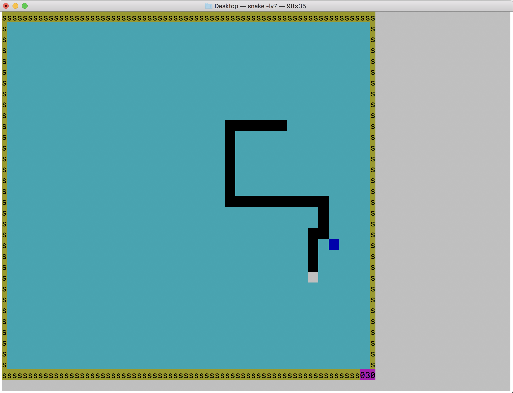

# mini-snake-game
This is a small and simple snake game implemented with C and [ncurses](https://en.wikipedia.org/wiki/Ncurses), a command line graphic library. 

Use `gcc Snake.c -l ncurses -o snake` to compile. You need to have **ncurses** installed on your machine. 

After compiling, run `./snake -lv[1~10]` to start the game with the level of your choice. 

 

In case you don't have ncurses but still want to try it out, I have compiled the game for you.

Download it [here](https://github.com/yuxuan-bill/mini-snake-game/raw/master/snake). (don't use Safari to download)

 

This game does not work on Windows since ncurses is not available there.

 

